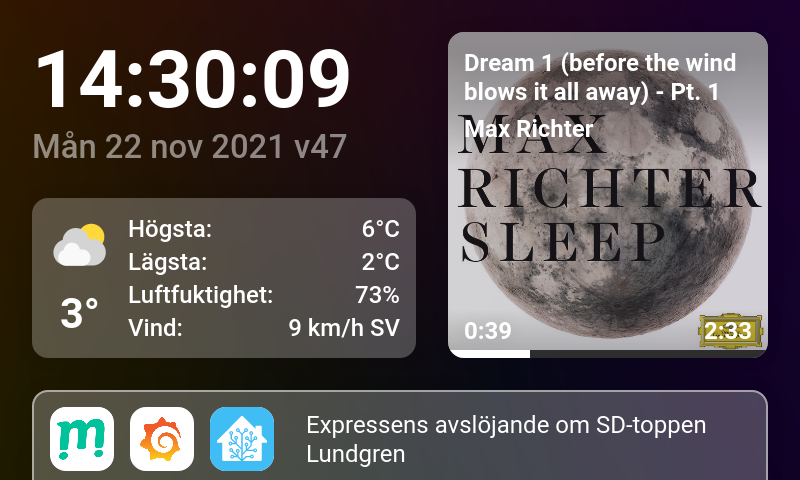

# Pihub v3

Webbsida att visa på en raspberry pi touch screen som använder sig av home assistant för att hämta data och visa upp på skärmen.

## Konfigurera:

Kopiera `src/config-example.json` till `src/config.json` och ändra värdena i filen.

## Använda:

Länka tjänstfilen med: `sudo systemctl link pihub.service`
Starta samt sätt på autostart för tjänsten med: `sudo systemctl enable --now pihub.service`
